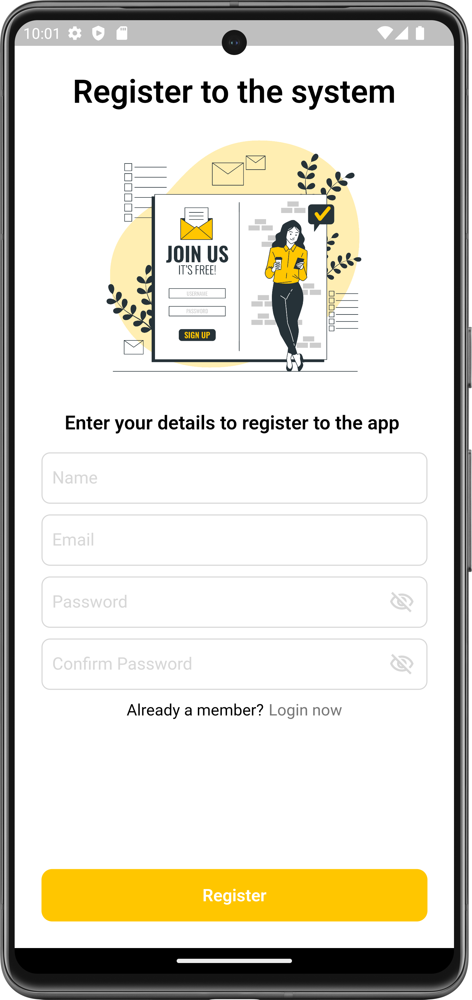
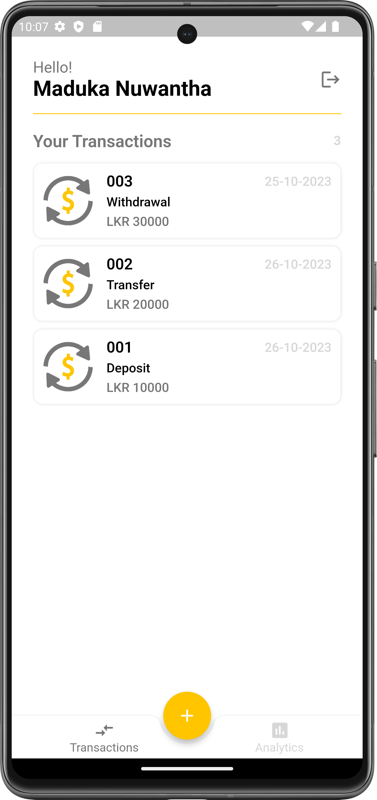
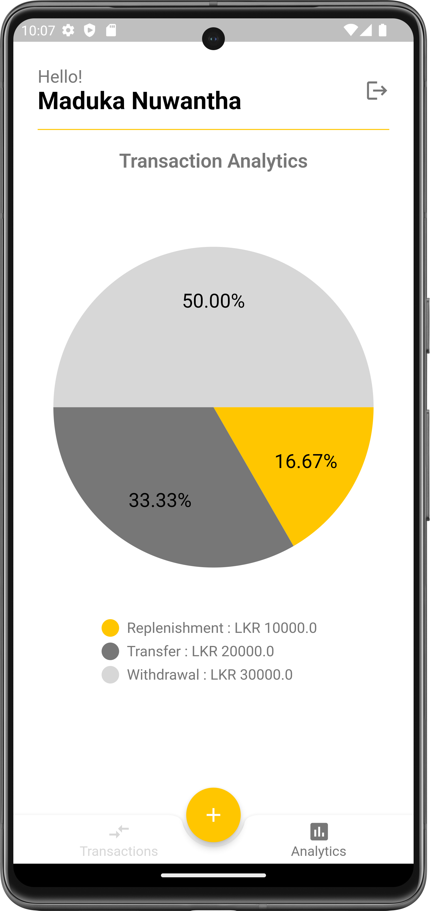
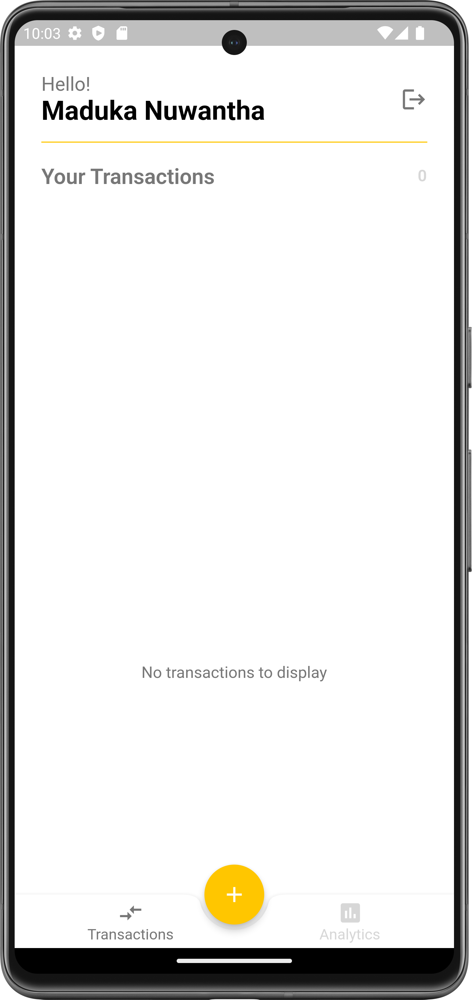
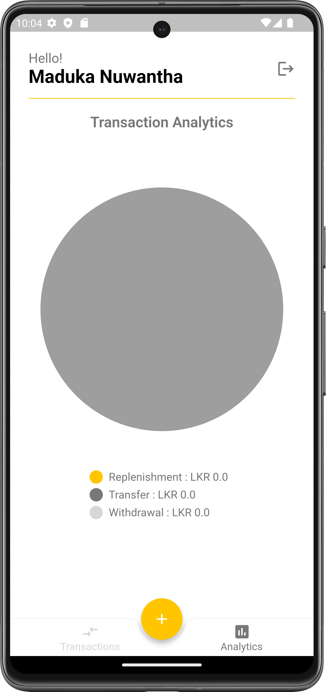
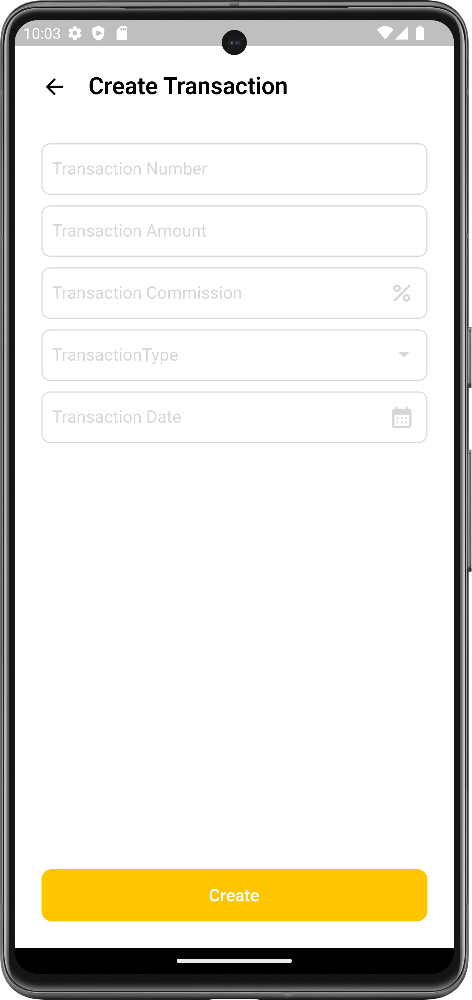
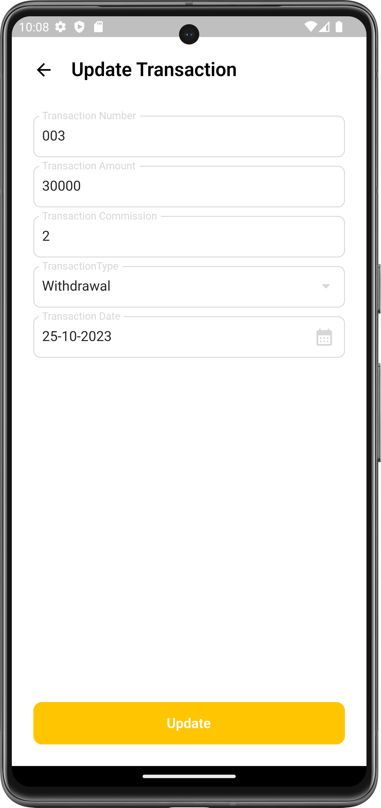
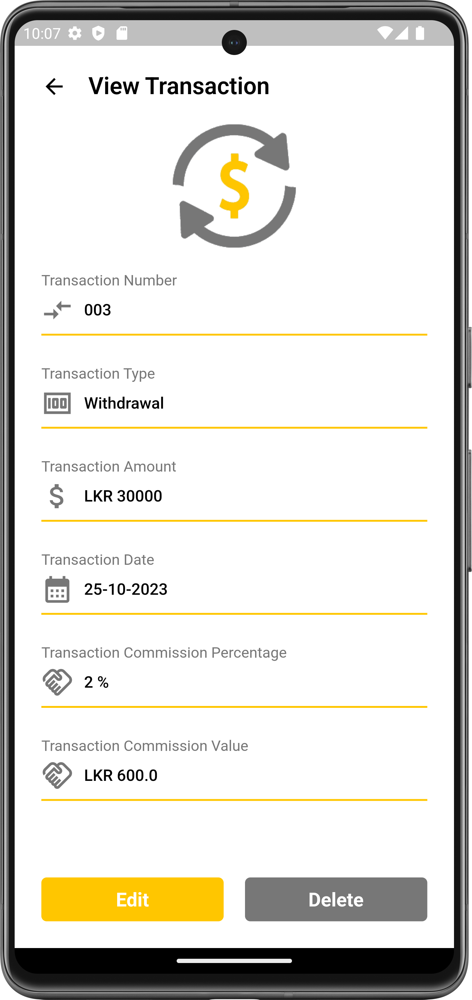
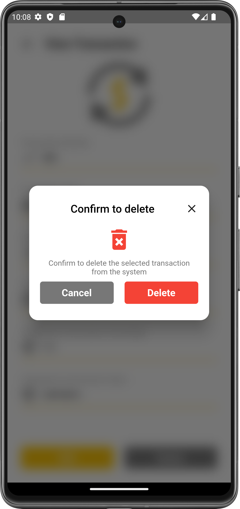

# EzyTransact Application

  
  &nbsp;&nbsp;&nbsp;&nbsp;&nbsp;

  
  &nbsp;&nbsp;&nbsp;&nbsp;&nbsp;  
  
  &nbsp;&nbsp;&nbsp;&nbsp;&nbsp;

  
  &nbsp;&nbsp;&nbsp;&nbsp;&nbsp;  
  
  &nbsp;&nbsp;&nbsp;&nbsp;&nbsp;

  
  &nbsp;&nbsp;&nbsp;&nbsp;&nbsp;  
  
  &nbsp;&nbsp;&nbsp;&nbsp;&nbsp;

  
  &nbsp;&nbsp;&nbsp;&nbsp;&nbsp;  
  
  &nbsp;&nbsp;&nbsp;&nbsp;&nbsp;

  &nbsp;&nbsp;&nbsp;&nbsp;&nbsp;
  
  &nbsp;&nbsp;&nbsp;&nbsp;&nbsp;  
  

